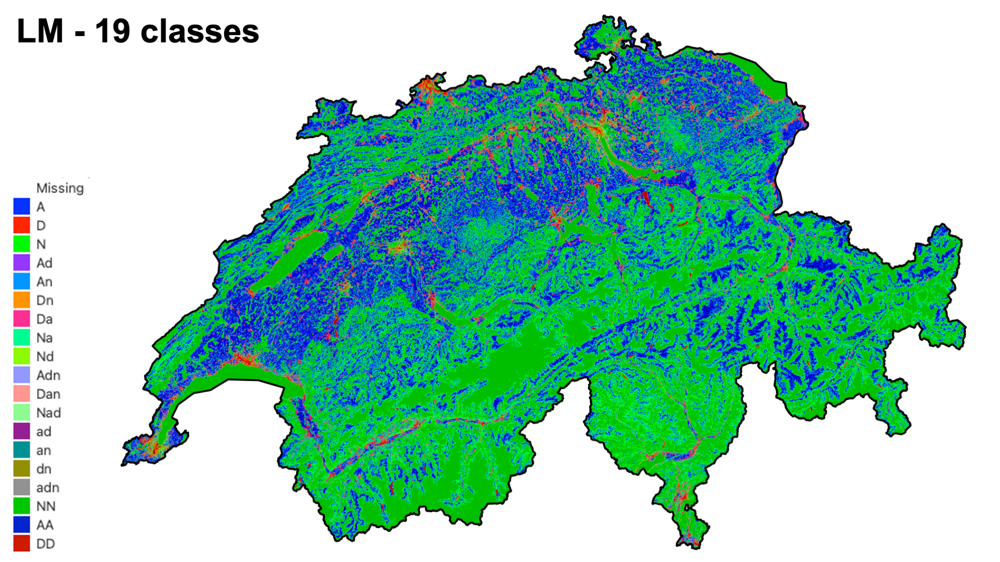
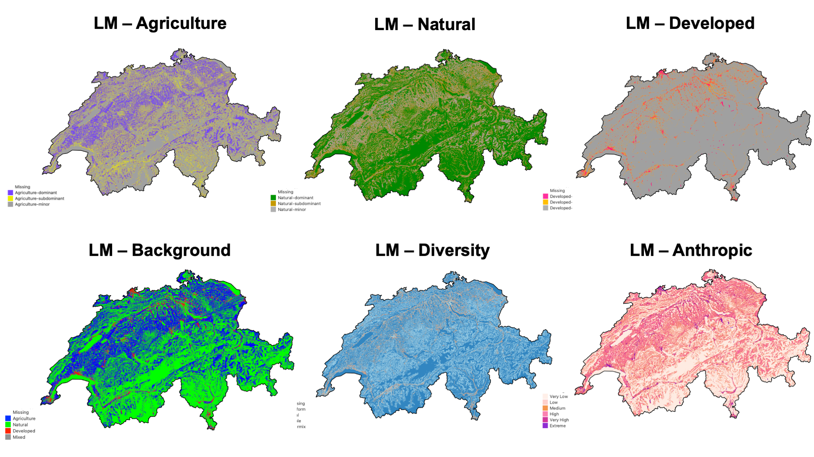

# Summary
Landscape ecology is the study of how different land uses and natural areas are arranged across a region, and how these spatial patterns affect biodiversity, ecosystem health, and human impacts. To measure and track these patterns, ecologists are using a range of tools and metrics that capture features such as connectivity, fragmentation, and the balance between natural and developed land [@frazier_landscape_2017]. One such method is the Landscape Mosaic (LM) approach, originally developed by @riitters_indicator_2009 and further developed by @vogt_revisiting_2024 which classifies land into categories based on the mix of agriculture, natural habitats, and developed areas (e.g., urban), providing an integrated view of how humans are influencing ecosystems. Until recently, LM was only available through a specialized software package (i.e., GuidosToolbox - @vogt_guidostoolbox_2017), which limits its flexibility, interaction with other tools, and integration in scientific workflows. To address this, we present PyLM,  a Python-based implementation of the LM model, making it easier for researchers, planners, and conservationists to analyze land use/cover (LUC) maps, generate statistics, and embed results into broader environmental workflows. This enhances accessibility, supports sustainability assessments, and strengthens the ability to monitor landscapes over time.

# Statement of need
Landscapes are defined as mosaics of different land cover, land use, habitats,and ecosystems. Landscape ecology is a field of ecology that specifically examines the spatial patterns of ecosystems and the processes that shape them across heterogeneous environments [@hesselbarth_computational_2024].  It emphasizes the relationships between spatial configuration (e.g., size, shape, distribution) and ecological dynamics including species movement, biodiversity, and ecosystem functioning [@riitters_indicator_2009]. To quantify these spatial patterns, a variety of metrics are available to account for characteristics such as patch area, diversity, density, connectivty and fragmentation [@hesselbarth_computational_2024; @etherington_nlmpy_2015; @bosch_pylandstats_2019].  These metrics serve as essential tools for conservation planning, habitat management, and sustainability research by providing a standardized way to analyze landscape structure, detect changes over time, and assess the impacts of natural disturbances or human activities like urbanization, agriculture, and deforestation.

To identify and assess spatial patterns, different methods are available enabling to monitor landscape's evolution and linking them to specific ecological processes [@riitters_forest_2020]. The Landscape Mosaic (LM) approach provides a framework for quantifying spatial heterogeneity by employing a tri-polar classification scheme based on three land use/cover (LUC) classes [@riitters_indicator_2009]. The method applies a moving window to quantify the relative proportions of the three classes within each focal grid cell. These proportions are subsequently assigned to one of 103 classes and aggregated into 19 mosaic categories, determined by threshold criteria that capture the dominance, presence, or absence of each classe. The LM approach is designed to characterize the spatial juxtaposition of anthropogenic (i.e., developed and agricultural areas) relative to natural land covers. By simultaneously evaluating these three dominant land cover types, the approach captures landscape composition, connectivity, and heterogeneity, thereby providing an integrated measure of human influence on landscapes. The indicator assigns each location to a category based on the relative proportions of Agriculture, Natural, and Developed land within its surrounding neighborhood [@riitters_indicator_2009; @vogt_revisiting_2024]. This classification supports the quantification and spatial assessment of landscape capacities to sustainably supply ecosystem services [@maes_mapping_2020]. The Landscape Mosaic provides a framework for assessing the state, pressures, and temporal dynamics of landscapes, including the intensity of land use across agricultural, urban, and natural ecosystems, as well as their complex interactions under changing environmental and socio-economic conditions [@vogt_revisiting_2024; @vogt_landscape_2024].

Currently there is only one implementation of the LM model within the GuidosToolbox (Graphical User Interface for the Description of image Objects and their Shapes - GTB) [@vogt_guidostoolbox_2017]. GTB is a free and open-source software with a set of customized and thematically grouped raster image processing routines mostly used in environmental, ecological, forestry, land cover / land use, and landscape‐ecology contexts. It is available through a Desktop application, for Windows, Mac and Linux as well as a command-line Linux server application for mass processing (GuidosToolbox Workbench GWB). Despite the fact that the LM model is available as single tool within GTB/GWB, it's interaction with other software/models is limited and therefore there is a need for having a version that could be available (1) as a standalone tool, (2) that could be executed both on a desktop or a server, (3) that could be easily embedded in processing chains/workflows or integrated in other analytical framework like LivingEarth [@owers_living_2021], (4) and based on common data science programming language such as Python.
Based on these considerations, PyLM provides a Python implementation of the Landscape Mosaic model enabling users to process any land cover map and generate the different stratification layers as well as relevant statistics (e.g., heatmap). PyLM offers increased accessibility, flexibility, and computational power for landscape ecology, allowing for easier analysis, customization, and integration with other open-source tools for research, conservation, and planning. PyLM could be executed either as a standalone Python script, within a Jupyter Notebook environment, and ultimately could be easily embbeded in any processing workflow. Overall PyLM simplifies the production of key landscape metrics necessary for environmental monitoring.

# Main modules
The analytical workflow follows a linear architecture, in which the output of each module constitutes the input for the subsequent module. Hereafter, we present the main modules and their respective tasks: 

- `Initialization`: This module first test if the necessary librairies are installed and then user is able to define both input and output folders.
- `Input data`: reads and provides information on the input raster map with no more than 3 target classes having the assignment AND (1 Byte - Agriculture, 2 Byte - Natural, 3 Byte - Developed) plus an optional class value of 0 Byte which is reserved for masking missing/no-data pixels. 
- `Map conversion [optional]`: Depending on the LUC used, this modules gives the flexibility to reclassify any LUC map to the 3-class raster map required by the LM model.
- `LM Analysis`: This the main module that computes first the proportion of A-N-D per pixel, then produces the 103 classes and 19 classes following [riitters_indicator_2009, vogt_revisiting_2024] \autoref{fig1}, and finally generates all the stratification layers \autoref{fig2}.
- `Moving window - 103 classes - 19 classes`: This sub-module computes the propostion of A-N-D classes on a per pixel basis and then computes the 103 classes and aggregates them into 19 classes.
- `LM Background`: summarizes the LM into 4 classes Natural - Agriculture - Developed - Mixed, showing the dominant presence of each LUC classes.
- `LM Diversity`: summarizes the LM into 4 classes to account the increasing degree of LUC diversity from Uniform, Dual, Triple, or Intermixed LUC, reporting on the degree of spatial heterogeneity.
- `LM Agriculture`: summarizes the LM into 3 classes showing where agricultural LUC is dominant (>=60%), subdominant, or minor (<10%), thereby enabling the determination of the anthropogenic impact from agriculture.
- `LM Natural`: summarizes the LM into 3 classes showing where natural LUC is dominant (>=60%), subdominant, or minor (<10%), allowing to determine the dominant natural classes not impacted by anthropogenic activies.
- `LM Developed`: summarizes the LM into 3 classes showing where developed LUC is dominant (>=60%), subdominant, or minor (<10%), allowing to determine the anthropogenic impact from urbanization.
- `LM Anthropic intensity`: summarizes the anthopic intensity into 6 classes from Very Low - Low - Medium - High - Very High - Extreme, to account for the anthropogenic impacts from agriculture and urbanization.
- `Heatmap`: provides summary statistics of the frequency distribution of the 103-classes within the ternary diagram.

# Installation
This package requires Python 3.10 or later and JupyterLab (server or desktop). It also requires the following packages: 
`rasterio`, `numpy`, `scipy`,  `matplotlib` and `csv`. These dependencies are automatically verified (and installed) within the <i>Intialization</i> module.

Users have to define the input (i.e., where the input LUC map in geotiff format is stored - `inputFolder`) and output (i.e., where all produced layers will be stored - `outputFolder`) folders. In addition, users can edit the file name of the LUC map in the `l3` variable.

# Auhtor contributions
Gregory Giuliani authored the original version of the package, developed the pipeline and all of its functions, maintained the package, wrote the documentation, debugged the code, and contributed to the drafting of the article.

# Ongoing research using PyLM
Research applicable with PyLM includes Land Degradation assessment (e.g., Horizon-Europe MONALISA project - <a href='https://monalisa4land.eu' target='_blank'>https://monalisa4land.eu</a>), ecosystem accounting (e.g., Horizon-Europe LandShift project - <a href='>https://landshift.eu' target='_blank'>https://landshift.eu)</a>, Dynamic & Quantitative Land Environmental Description System (e.g., SNSF DynamicLand project - <a href='https://data.snf.ch/grants/grant/221323' target='_blank'>https://data.snf.ch/grants/grant/221323</a>) or the developement of Digital Twin of the Environment (e.g., SNSF DT4LC - <a href='https://data.snf.ch/grants/grant/224912' target='_blank'>https://data.snf.ch/grants/grant/224912</a>)
 
# Acknowledgements
The author would like to acknowledge the European Union ‘Horizon Europe Program’ that funded the LandShift (Grant Agreement no. 101182007) and the MONALISA (Grant Agreement no. 101157867) projects as well as the Swiss National Science Foundation that funded the DynamicLand project (Grant no. 221323) for their respective support.
The author acknowledge contributions from Lucie Schlumpf and Carole Planque for their help in testing the package. Their input and feedback were essential in identifying and resolving technical issues, ensuring the accuracy and reliability of the results.

# References